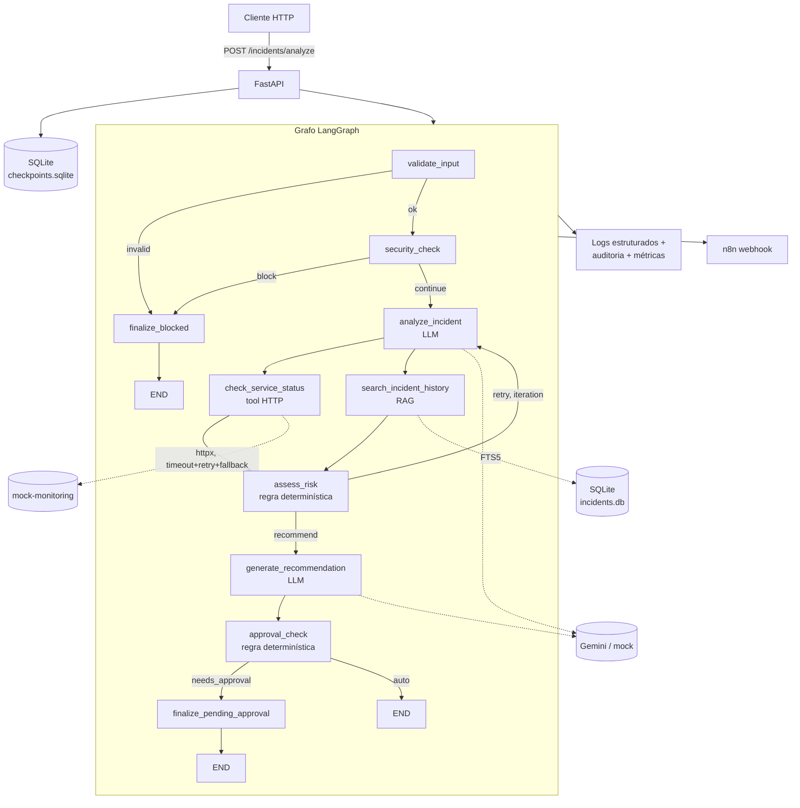

# Arquitetura — IncidentAI

## Classificação

**Sistema híbrido.** O LLM decide *classificação e narrativa* (categoria
do incidente, causa provável, redação das ações recomendadas); regras
determinísticas decidem *tudo que tem consequência* (severidade, score de
risco, tendência, se uma ação precisa de aprovação humana, se algo é
bloqueado). Essa separação é testada explicitamente em
`tests/unit/test_risk_llm_separation.py`: mutar `category`/`probable_cause`/
`confidence` (campos do LLM) não muda `severity`/`risk_score`/
`failure_risk`; mudar `environment` (campo de regra) muda.

## Visão geral

### Paralelização real

`check_service_status` e `search_incident_history` rodam no **mesmo
superstep** do LangGraph (fan-out de duas arestas a partir de
`analyze_incident`, fan-in em `assess_risk`) — não é paralelismo só na
topologia do desenho: `tests/integration/test_graph_execution.py::
test_fanout_topology_runs_nodes_concurrently` mede tempo de parede e prova
que dois nós de 0.1s cada terminam em ~0.1s total, não ~0.2s.

### Loop de retry com parada garantida

Se `analyze_incident` produz confiança baixa na primeira passada,
`assess_risk` decide retry (`route_after_risk`) e o grafo volta para
`analyze_incident` — desta vez com a evidência já coletada (histórico do
serviço, incidentes similares) disponível no prompt, então a segunda
tentativa pode genuinamente mudar de resposta, não é um no-op. Parada
garantida em duas camadas: `iteration_count < MAX_ITERATIONS` (padrão 3)
na condição de roteamento, e `recursion_limit` no `graph.ainvoke()` como
rede de segurança caso a primeira falhe por algum bug de wiring.

## Nós e responsabilidades

| Nó | Tipo | Responsabilidade |
|---|---|---|
| `validate_input` | regra | valida payload além do Pydantic (environment, campos vazios) |
| `security_check` | regra | blocklist de prompt injection sobre `description`/`logs` |
| `analyze_incident` | LLM | categoria, causa provável, confiança, sinais-chave |
| `check_service_status` | tool | status/histórico do serviço via HTTP resiliente |
| `search_incident_history` | RAG | incidentes similares + trechos de runbook (FTS5), filtrados contra a blocklist |
| `assess_risk` | regra | tendência (`app/risk/anomaly.py`), score, severidade |
| `generate_recommendation` | LLM | ações recomendadas, usando a evidência do RAG |
| `approval_check` | regra | classifica a ação (READ/…/DELETE) e decide se precisa aprovação humana |
| `finalize_blocked` / `finalize_pending_approval` | regra | garantem que todo caminho terminal produz uma resposta completa |

## Componentes e integrações

- **Tool HTTP real + MCP** (Fase 4): `app/tools/core.py` é a fonte única
  das tools; consumida in-process pelo grafo (`app/tools/registry.py`,
  `TOOLS_TRANSPORT=inprocess`) ou via servidor MCP real
  (`mcp_server/server.py`, `TOOLS_TRANSPORT=mcp`) — mesma implementação,
  dois transportes.
- **Memória/RAG** (Fase 5): checkpointer (`AsyncSqliteSaver`, um thread
  por `incident_id`) + FTS5 sobre incidentes históricos e runbooks
  markdown, sem vector DB.
- **Segurança** (Fase 7): guardrails na entrada e no conteúdo recuperado,
  políticas de autonomia (`app/security/policies.py`), redação de
  segredos na saída.
- **Observabilidade** (Fase 8): logs estruturados JSON + auditoria em
  SQLite + métricas em memória, todos correlacionados por `trace_id`.
- **Low-code** (Fase 11): `app/services/notifier.py` dispara um webhook
  para `n8n/incidentai-alert.json` quando a severidade atinge o limiar.

Ver `README.md` para instalação/execução e `docs/qa/` para evidências de
QA, DevOps e o ciclo de refinamento desta arquitetura.
